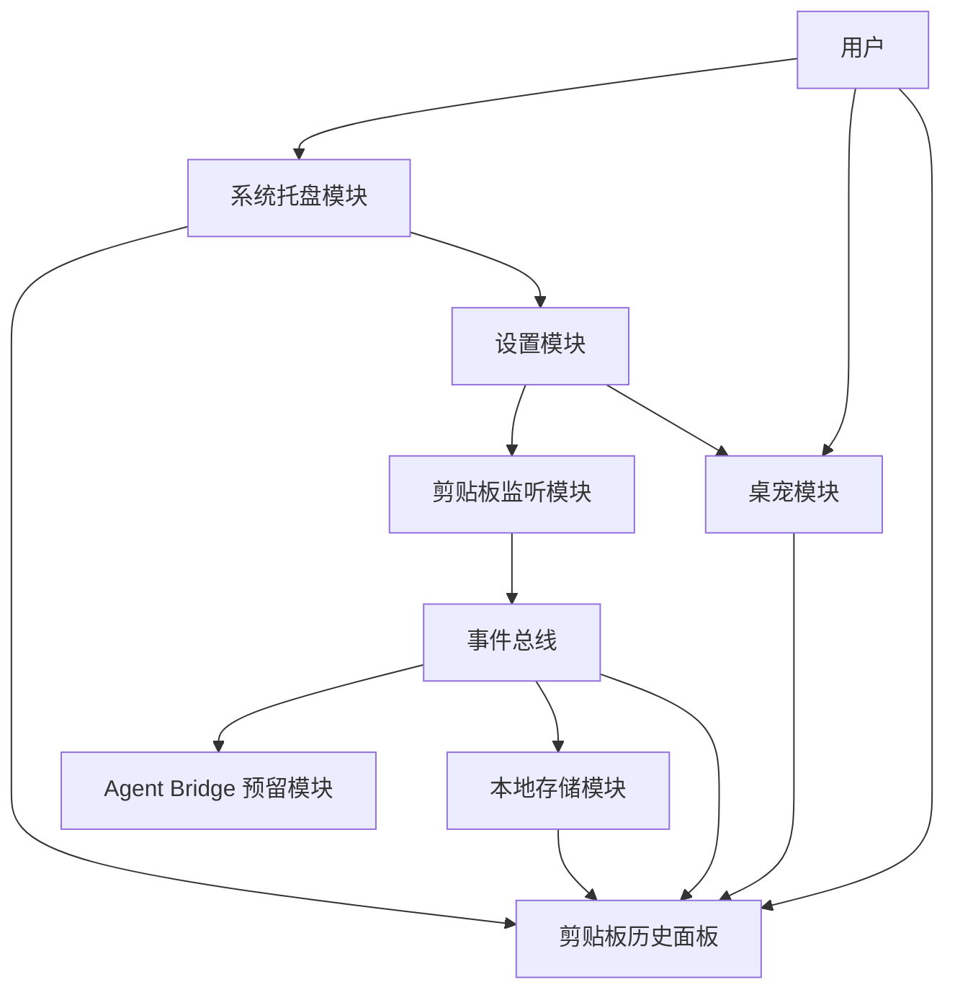
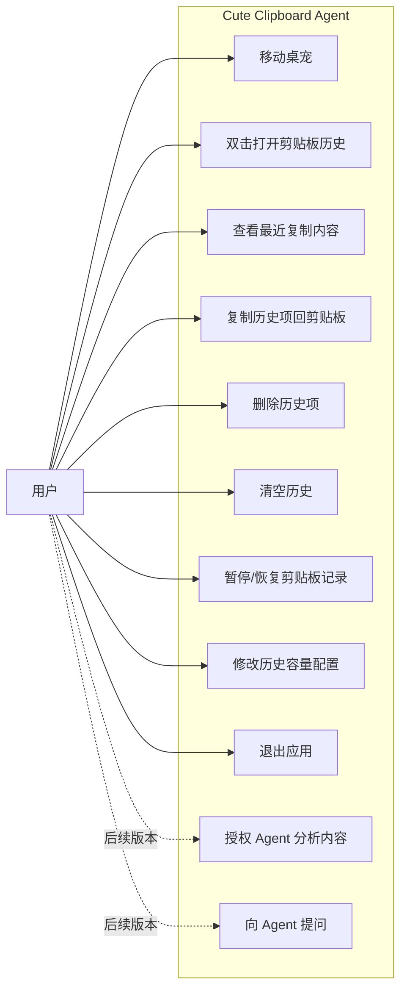
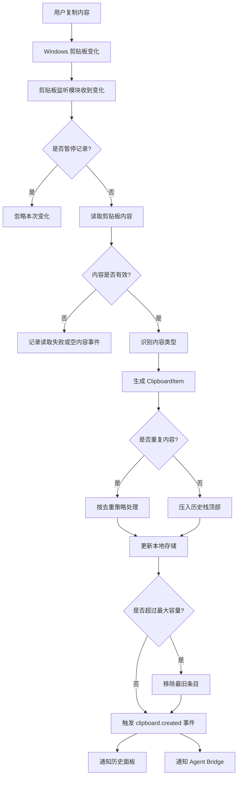
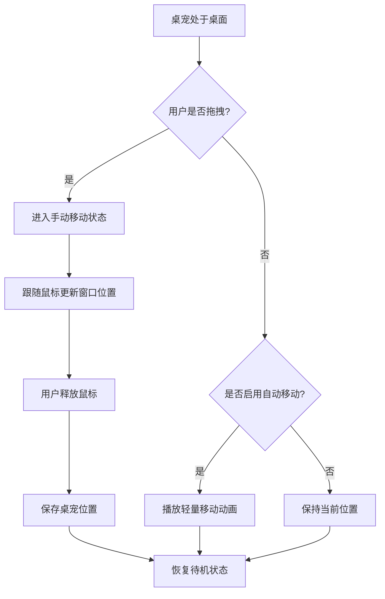
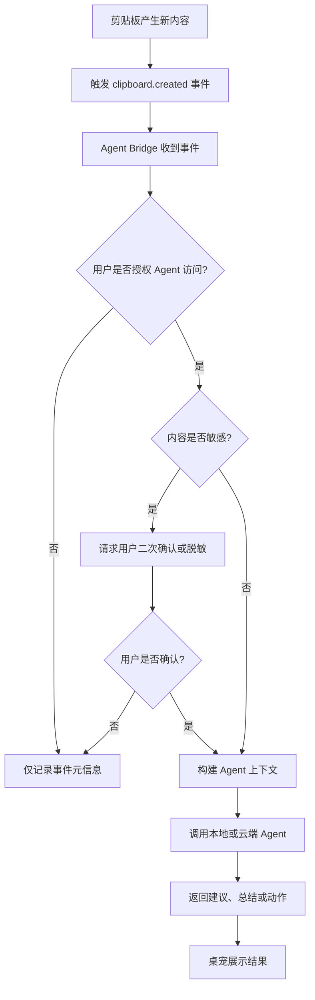

# Cute Clipboard Agent MRD

## 1. 需求背景

### 1.1 项目概述

Cute Clipboard Agent 是一款面向 Windows 桌面的桌宠型剪贴板助手。产品以一个可交互、可移动、可陪伴的桌宠作为入口，帮助用户管理最近复制过的文本、emoji、图片等剪贴板内容，并为后续接入 Agent 能力预留事件驱动架构。

第一阶段产品聚焦于“桌宠 + 剪贴板历史管理”的核心体验：用户在 Windows 桌面上双击桌宠后，可以打开最近剪贴板历史面板，查看、搜索、恢复最近复制的内容。剪贴板历史采用类似栈的数据结构，默认最多保留 20 条，并支持后续配置。

第二阶段产品将接入 Agent 能力，使桌宠不仅是剪贴板管理工具，也能成为用户工作时的陪伴型助手，例如理解复制的代码、总结文本、识别截图内容、辅助检索历史片段、根据上下文主动提醒等。

### 1.2 目标用户

- 经常复制文本、代码、图片、emoji 的 Windows 用户。
- 希望用更轻量、更可爱的方式管理剪贴板历史的用户。
- 长时间在桌面环境工作的开发者、设计师、运营、内容创作者。
- 希望未来拥有一个可陪伴式桌面 Agent 的效率工具用户。

### 1.3 用户痛点

- Windows 自带剪贴板历史能力有限，视觉体验和交互入口较工具化。
- 常规剪贴板管理器功能强，但缺少陪伴感和轻量交互。
- 用户复制过的重要内容容易被后续复制操作覆盖。
- 图片、emoji、代码片段等内容在历史列表中缺少友好的预览方式。
- Agent 工具通常以聊天窗口或浏览器插件存在，缺少和桌面工作流自然融合的入口。

### 1.4 产品目标

- 提供一个常驻桌面的可爱桌宠作为剪贴板入口。
- 支持记录最近复制的文本、emoji、图片等内容。
- 支持双击桌宠快速打开剪贴板历史面板。
- 支持点击历史项后恢复到系统剪贴板。
- 支持配置剪贴板栈容量，默认最多保留 20 条。
- 通过事件驱动设计为后续 Agent 能力预留扩展入口。
- 默认本地优先，强调隐私保护和用户授权。

### 1.5 非目标范围

第一阶段暂不包含以下能力：

- 云同步剪贴板历史。
- 多设备共享。
- 完整 Agent 对话系统。
- OCR、图片理解、代码理解等 AI 能力。
- 团队协作功能。
- macOS、Linux 跨平台适配。

以上能力可作为后续版本规划。

## 2. 核心需求

### 2.1 桌宠入口

桌宠是产品的主要入口，常驻于 Windows 桌面。

核心需求：

- 桌宠以透明、无边框窗口形式展示。
- 桌宠默认置顶或保持在桌面可见区域。
- 用户可以通过鼠标拖动桌宠改变位置。
- 桌宠会在空闲状态下进行轻量移动或播放待机动画。
- 用户双击桌宠后打开剪贴板历史面板。
- 用户右键桌宠或托盘图标可打开快捷菜单。

快捷菜单建议包含：

- 打开剪贴板历史。
- 暂停记录剪贴板。
- 清空剪贴板历史。
- 打开设置。
- 退出应用。

### 2.2 剪贴板监听

应用需要在后台监听系统剪贴板变化，并将符合条件的内容写入本地历史栈。

支持内容类型：

- 文本。
- emoji。
- 图片。

后续可扩展内容类型：

- HTML 富文本。
- 文件路径。
- URL。
- 代码片段。
- 截图。
- 自定义格式。

监听规则：

- 当系统剪贴板发生变化时，应用读取当前剪贴板内容。
- 应用识别内容类型并生成统一的剪贴板条目。
- 若内容为空或读取失败，则不入栈。
- 若内容与栈顶完全重复，则默认不重复入栈。
- 若内容与历史中某条重复，可配置为忽略或移动到栈顶。
- 当历史数量超过最大容量时，移除最旧条目。

### 2.3 剪贴板历史栈

剪贴板历史采用栈结构，最新复制内容位于顶部。

默认配置：

- 默认最多保留 20 条。
- 用户后续可配置容量，例如 10、20、50。
- 文本内容保存原文和预览文本。
- 图片内容保存缩略图和本地图片路径。
- emoji 按文本类型处理，但在 UI 中需要保持原始显示效果。

剪贴板条目建议结构：

```ts
type ClipboardItem = {
  id: string
  type: 'text' | 'image'
  preview: string
  text?: string
  imagePath?: string
  thumbnailPath?: string
  hash: string
  sourceApp?: string
  createdAt: number
  updatedAt: number
}
```

### 2.4 剪贴板历史面板

用户双击桌宠后打开剪贴板历史面板。

核心需求：

- 面板展示最近复制内容列表。
- 最新内容显示在顶部。
- 文本内容展示预览文本。
- emoji 内容保持原始 emoji 渲染。
- 图片内容展示缩略图。
- 用户点击某条历史后，该内容重新写入系统剪贴板。
- 用户可以删除单条历史。
- 用户可以清空全部历史。
- 用户可以关闭面板并返回桌宠状态。

后续增强：

- 搜索历史。
- 收藏历史。
- 固定某条内容不被自动淘汰。
- 按类型筛选。
- 快捷键打开面板。
- 面板跟随桌宠位置弹出。

### 2.5 设置模块

设置模块用于控制应用行为。

第一阶段建议包含：

- 剪贴板历史最大容量。
- 是否记录文本。
- 是否记录图片。
- 是否显示桌宠待机动画。
- 是否允许桌宠自动移动。
- 是否开机启动。
- 是否启用本地持久化。
- 是否暂停剪贴板记录。

后续可扩展：

- 敏感内容保护。
- 忽略指定应用。
- 自动清理周期。
- Agent 授权设置。
- 本地模型或云模型配置。
- MCP 服务配置。

### 2.6 隐私与安全

剪贴板属于高敏感数据来源，产品需要从第一阶段开始建立隐私边界。

基础要求：

- 默认本地存储，不上传任何剪贴板内容。
- 首次启动时提示用户应用会监听剪贴板。
- 提供暂停记录能力。
- 提供清空历史能力。
- 图片和文本持久化可配置。
- 后续 Agent 分析剪贴板内容前必须获得用户授权。

敏感内容策略建议：

- 支持用户手动删除敏感条目。
- 后续支持自动识别疑似密码、Token、银行卡号、身份证号。
- 后续支持对敏感内容只保留临时内存，不落盘。
- 后续支持忽略来自指定应用的剪贴板内容。

## 3. 功能模块

### 3.1 模块总览



### 3.2 桌宠模块

职责：

- 展示桌宠形象。
- 管理桌宠窗口位置。
- 响应拖拽、双击、右键等交互。
- 播放待机动画和轻量移动动画。
- 向剪贴板历史面板发送打开事件。

关键事件：

- `pet.double_clicked`
- `pet.drag_started`
- `pet.drag_ended`
- `pet.idle_started`
- `pet.idle_moved`

### 3.3 剪贴板监听模块

职责：

- 监听 Windows 剪贴板变化。
- 读取剪贴板当前内容。
- 判断内容类型。
- 生成剪贴板条目。
- 触发剪贴板创建事件。

关键事件：

- `clipboard.changed`
- `clipboard.created`
- `clipboard.duplicated`
- `clipboard.read_failed`

### 3.4 本地存储模块

职责：

- 保存剪贴板历史。
- 保存图片原图或缩略图。
- 保存应用配置。
- 控制历史栈容量。
- 提供历史查询、删除、清空能力。

建议存储：

- 配置数据：JSON 或 SQLite。
- 文本历史：SQLite。
- 图片文件：应用数据目录。
- 图片元数据：SQLite。

### 3.5 历史面板模块

职责：

- 展示剪贴板历史列表。
- 根据内容类型渲染不同预览。
- 支持点击恢复剪贴板。
- 支持删除、清空、后续搜索和筛选。

关键事件：

- `panel.opened`
- `panel.closed`
- `history.item_selected`
- `history.item_deleted`
- `history.cleared`

### 3.6 设置模块

职责：

- 展示和修改用户配置。
- 将配置变更同步给相关模块。
- 管理剪贴板记录开关、栈容量、桌宠行为等。

关键事件：

- `settings.updated`
- `settings.clipboard_recording_paused`
- `settings.clipboard_recording_resumed`

### 3.7 系统托盘模块

职责：

- 提供后台常驻入口。
- 提供快捷操作菜单。
- 支持应用退出。
- 支持打开设置和历史面板。

### 3.8 Agent Bridge 预留模块

职责：

- 作为后续 Agent 能力的接入层。
- 订阅应用内部事件。
- 管理 Agent 可访问的数据范围。
- 管理用户授权。
- 对外提供统一上下文接口。

第一阶段 Agent Bridge 可以仅实现事件接口和空处理逻辑，不接入真实模型。

## 4. 用例图



## 5. 业务流程图

### 5.1 剪贴板记录流程



### 5.2 双击桌宠查看历史流程

```mermaid
flowchart TD
  A["用户双击桌宠"] --> B["桌宠模块触发 pet.double_clicked"]
  B --> C["打开剪贴板历史面板"]
  C --> D["读取本地历史栈"]
  D --> E["按时间倒序渲染列表"]
  E --> F{"用户选择操作"}
  F -- 点击历史项 --> G["写回系统剪贴板"]
  F -- 删除单项 --> H["删除本地历史项"]
  F -- 清空历史 --> I["清空本地历史"]
  F -- 关闭面板 --> J["返回桌宠常驻状态"]
```



### 5.3 桌宠移动流程



### 5.4 Agent 后续分析流程



## 6. 事件驱动设计

### 6.1 设计原则

产品需要从第一阶段开始采用事件驱动架构，避免后续接入 Agent 时大量改造核心流程。

核心原则：

- 剪贴板监听、历史存储、UI 展示、Agent 分析之间通过事件解耦。
- 第一阶段即定义稳定事件结构。
- Agent Bridge 可以在第一阶段作为空实现存在。
- 用户隐私授权状态必须进入事件处理流程。
- 事件 payload 需要区分元信息和完整内容。

### 6.2 核心事件

```ts
type AppEvent =
  | ClipboardCreatedEvent
  | ClipboardDeletedEvent
  | HistoryClearedEvent
  | PetDoubleClickedEvent
  | SettingsUpdatedEvent
  | AgentPermissionChangedEvent

type ClipboardCreatedEvent = {
  type: 'clipboard.created'
  payload: {
    id: string
    contentType: 'text' | 'image'
    preview: string
    hasFullText: boolean
    hasImage: boolean
    createdAt: number
  }
}
```

### 6.3 内容访问分级

为保护隐私，事件中建议区分三层数据：

- 元信息：内容类型、创建时间、预览长度、是否图片。
- 预览信息：短文本预览、图片缩略图。
- 完整内容：完整文本、原图文件。

Agent 默认只能读取元信息。读取预览或完整内容需要用户授权。

## 7. Agent 后续拓展

### 7.1 Agent 能力方向

后续 Agent 可以围绕剪贴板上下文提供以下能力：

- 文本总结：总结最近复制的一段长文本。
- 代码解释：解释复制的代码片段。
- 错误分析：识别复制的报错信息并给出建议。
- 图片理解：对复制的截图进行 OCR 或视觉分析。
- 历史检索：根据自然语言搜索历史剪贴板。
- 工作陪伴：根据用户复制内容推测当前工作状态并轻量提示。
- 快捷动作：将复制内容转换格式、翻译、改写、生成 Markdown。
- 开发者辅助：结合 IDE、终端、Git 状态提供上下文帮助。

### 7.2 Agent 接入方式

候选方案：

- 云端大模型 API。
- 本地大模型。
- MCP Server。
- 本地 Agent Runtime。
- 与 IDE 插件或浏览器插件联动。

第一阶段不绑定具体 Agent 实现，只保留 Agent Bridge 接口。

### 7.3 Agent 权限模型

Agent 访问剪贴板内容必须经过权限控制。

建议权限分级：

- 不允许：Agent 不读取任何剪贴板内容。
- 仅元信息：Agent 只知道发生了复制事件和内容类型。
- 允许预览：Agent 可读取短文本预览或图片缩略图。
- 允许完整内容：Agent 可读取完整文本或图片。
- 单次授权：仅对某一次分析授权。
- 会话授权：当前应用运行期间有效。
- 持久授权：用户明确开启后长期有效。

### 7.4 Agent 触发方式

建议支持三种触发模式：

- 手动触发：用户点击某条历史项上的 Agent 操作。
- 半自动触发：桌宠发现可能有价值的内容后轻量提示。
- 自动触发：用户明确开启后，Agent 自动分析特定类型内容。

第一阶段只需要为这些触发模式预留事件字段，不需要实现真实分析。

### 7.5 Agent 上下文结构

```ts
type AgentContext = {
  source: 'clipboard' | 'user_prompt' | 'pet_interaction'
  permissionLevel: 'metadata' | 'preview' | 'full'
  clipboardItemIds: string[]
  userPrompt?: string
  appState: {
    panelOpen: boolean
    recordingPaused: boolean
  }
  createdAt: number
}
```

## 8. 发布与分发需求

### 8.1 Windows 发布形态

第一阶段建议提供：

- Windows 安装包。
- 便携版压缩包。
- GitHub Releases 下载。

后续可扩展：

- 自动更新。
- Microsoft Store。
- 代码签名证书。

### 8.2 安装后行为

- 安装后可从开始菜单启动。
- 首次启动展示剪贴板监听说明。
- 用户可选择是否开机启动。
- 应用关闭窗口后默认进入托盘常驻。
- 用户可从托盘彻底退出。

### 8.3 可信分发

由于应用会监听剪贴板，发布时需要明确说明：

- 监听目的。
- 存储位置。
- 是否上传数据。
- 如何清空历史。
- 如何暂停记录。
- 后续 Agent 是否会读取剪贴板内容。

## 9. 成功指标

第一阶段建议关注：

- 用户能否在 3 秒内打开最近剪贴板历史。
- 文本、emoji、图片复制是否能稳定入栈。
- 点击历史项恢复剪贴板是否成功。
- 桌宠拖动是否流畅。
- 应用后台运行是否稳定。
- 用户是否理解应用正在监听剪贴板。

可量化指标：

- 剪贴板监听成功率。
- 图片记录成功率。
- 应用崩溃率。
- 平均内存占用。
- 历史项恢复成功率。
- 首次启动授权完成率。

## 10. 版本规划

### 10.1 MVP 版本

- Windows 桌宠基础展示。
- 桌宠拖拽和双击。
- 剪贴板文本、emoji、图片监听。
- 最近 20 条历史栈。
- 历史面板展示。
- 点击历史项恢复剪贴板。
- 清空历史。
- 暂停记录。
- 本地配置。
- Agent Bridge 空实现。

### 10.2 V1 版本

- 历史搜索。
- 类型筛选。
- 单条删除。
- 系统托盘。
- 开机启动。
- 图片缩略图优化。
- 隐私设置。
- 忽略指定应用。

### 10.3 V2 版本

- Agent 手动分析。
- 文本总结。
- 代码解释。
- 报错分析。
- 自然语言搜索剪贴板历史。
- 单次授权和会话授权。

### 10.4 V3 版本

- 图片 OCR。
- 截图理解。
- MCP 接入。
- IDE 或浏览器上下文联动。
- 桌宠主动提醒。
- 多角色桌宠。

## 11. 技术栈建议

### 11.1 推荐技术栈

- 桌面框架：Tauri。
- 前端框架：React。
- 前端语言：TypeScript。
- 原生能力：Rust。
- 本地数据库：SQLite。
- 图片存储：本地应用数据目录。
- 状态管理：Zustand 或 Jotai。
- 构建工具：Vite。
- UI 动画：CSS Animation、Canvas、Lottie 或 Live2D。
- Windows API：剪贴板监听、窗口控制、系统托盘、开机启动。

### 11.2 技术分工

React 负责：

- 桌宠界面。
- 剪贴板历史面板。
- 设置页。
- Agent 对话和提示 UI。
- 动画和交互。

Rust 负责：

- Windows 剪贴板监听。
- 系统托盘。
- 本地存储。
- 图片文件管理。
- 窗口控制。
- Agent Bridge 原生接口。

Tauri 负责：

- 连接 React 与 Rust。
- 应用窗口管理。
- 应用打包。
- 权限和插件体系。
- 跨平台基础能力。

### 11.3 架构建议

第一阶段即保留以下目录思路：

```txt
src/
  app/
  features/
    pet/
    clipboard/
    history/
    settings/
    agent-bridge/
  shared/
src-tauri/
  src/
    clipboard/
    storage/
    window/
    tray/
    agent_bridge/
```

其中 `agent-bridge` 即使第一阶段不实现真实 Agent，也应保留事件类型、权限模型和空处理器。
